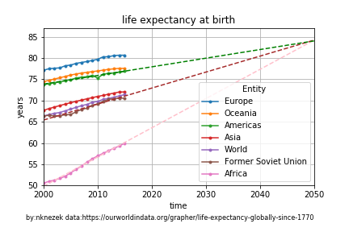

# Good News Today - People are living longer all over the world!

Today's good news is that people are living longer all over the world! Life expectancy in Africa has gone up by ~7 years in the last decade, while in the developed world it's gone up by 1-2 years. If these trend lines continue, Africa, the Americas, and the Former Soviet Union will all have a life expectancy at birth of ~84 yrs in 2050!

